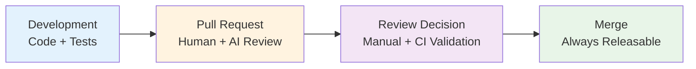

# AI-Powered Development Workflow Proposal

## Executive Summary

Mandatory AI integration into the development workflow to boost code quality and efficiency. The enhanced process preserves existing CI/CD while requiring AI-assisted code review and test generation.

**Key Changes:**
- Required AI review for all pull requests
- Mandatory test case commits with all code changes
- Enhanced whitebox testing with AI-generated test cases

**Expected Outcomes:**
- Reduced manual review effort through AI-assisted analysis
- Improved test coverage and bug detection
- Faster development cycles with automated test generation

**Implementation Risk:** Low - builds on existing development processes with incremental AI enhancements.

---

## Proposed Development Workflow

### Design Rationale
* **Always Releasable:** All code changes validated before merge. Main branch remains stable for releases.
* **Shift-Left Testing:** Early bug detection reduces fix costs and prevents bugs from reaching users.

### 1. Development Phase
- Engineer creates feature branch
- **Mandatory:** Commit code with corresponding test cases

### 2. Pull Request Phase
- Engineer creates PR and requests reviewer
- **Mandatory:** AI review alongside human reviewer
- PR validation includes:

#### Manual Review
- Code quality assessment
- Test case completeness verification
- Test case correctness validation

#### CI Validation (Automated)
- Build execution
- SonarQube static analysis
- Whitebox test execution
- **New:** Code coverage validation (>30% threshold for new code only)

### 3. Review Decision
- Reviewer evaluates combined results:
  - Human code review findings
  - AI review recommendations
  - CI validation results
- Approval decision based on all criteria

### 4. Merge
- Approved PRs merged to target branch
- All quality gates must pass

### Key Workflow Changes
| Component | Current | Proposed |
|-----------|---------|----------|
| Test Cases | Optional | **Mandatory** |
| AI Review | Optional | **Mandatory** |
| Whitebox Testing | Regression focus | **New changes + regression** |
| Code Coverage | No enforcement | **>30% threshold for new code** |

---

## AI Enhancement Details

### AI-Assisted Code Review
- Code change summarization and improvement recommendations
- Reduces manual review time and improves consistency
- Catches common issues early

### AI-Assisted Test Generation
- Comprehensive test case generation for happy path and edge cases
- Increases test coverage while reducing manual effort
- Accelerates development velocity

---

## Technical Implementation

### Quality Assurance Strategy
- **SonarQube remains primary CI gate:** Rule-based analysis for coding standards and anti-pattern detection
- **AI supplements, not replaces:** AI tools enhance existing processes without disrupting proven quality mechanisms
- **Incremental adoption:** Build on established development workflows

### Whitebox Testing Clean as You Code Implementation
- **New code definition:** Focus testing on code changes since previous version
- **Testing strategy:** AI-generated tests target new code changes with comprehensive coverage
- **Progressive quality improvement:** Each PR incrementally improves overall test coverage and quality
- **Efficient resource allocation:** Concentrate testing effort on recent changes rather than entire codebase

---

## Success Metrics

### Quality Metrics
- Code coverage percentage increase
- Bug detection rate improvement
- Review cycle time reduction

### Efficiency Metrics
- Time to merge reduction
- Test case generation speed
- Developer productivity increase

### Adoption Metrics
- AI review utilization rate
- Developer satisfaction scores
- Process compliance rates

---

## Conclusion

AI-powered development workflow implements shift-left testing principles to ensure early bug detection and maintain an always-releasable main branch. Combining mandatory AI assistance with Clean as You Code whitebox testing achieves progressive quality improvement while focusing resources on new code changes.

**Key Benefits:**
- **Shift-left approach:** Early validation reduces fix costs and prevents user-facing bugs
- **Always releasable:** Pre-merge validation ensures release readiness  
- **Efficient testing:** Clean as You Code focuses effort on new changes, not legacy code
- **AI acceleration:** Automated test generation and code review reduce manual overhead

Incremental enhancement of existing processes minimizes adoption risk while delivering measurable improvements in code quality, development velocity, and engineering efficiency.

**Recommendation:** Approve pilot implementation, followed by measured rollout to engineering teams based on success metrics.
