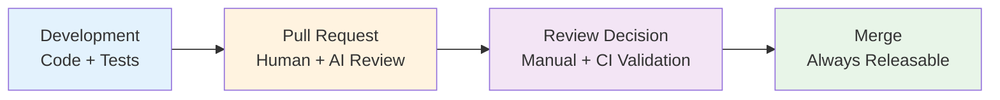

# AI-Powered Development Workflow — Proposal

Audience: Engineering VP + RD teams (read-ahead / leave-behind; no live presenter). Source: ai-powered-development-workflow.md.

---

## Slide 1 — Executive summary

| | |
|---|---|
| **Question** | With AI's help, what can RD do to raise product quality? |
| **Today** | Quality relies on manual review and late-stage QA — no consistent quality gate at the RD stage. |
| **Proposal** | Put **AI to work at two points** — **AI code review** and **AI-generated test cases** — both mandatory at PR; enforced by a **>30%** new-code coverage gate. |
| **Expected outcomes** | Higher product quality — fewer defects reach production Lower fix cost — bugs caught early, not in late QA / production Freed engineering capacity — less time on routine review and test-writing |
| **Next steps** | Pilot on `rd-cc-myedit-aol-svr-api`, then metric-gated rollout to engineering teams. |

---

## Slide 2 — Proposed workflow

```mermaid
flowchart LR
    A[Development<br/>Code + Tests] --> B[Pull Request<br/>Human + AI Review]
    B --> C[Review Decision<br/>Manual + CI Validation]
    C --> D[Merge<br/>Always Releasable]

    style A fill:#e3f2fd
    style B fill:#fff3e0
    style C fill:#f3e5f5
    style D fill:#e8f5e8
```

**Changes from current process**

| Component | Current | Proposed |
|-----------|---------|----------|
| Test cases | Optional | **Mandatory** |
| AI review | Optional | **Mandatory** |
| Code coverage | No enforcement | **>30%, new code only** |

*Per-phase steps and the Manual-vs-CI breakdown: Appendix A.*

---

## Slide 3 — AI enhancements

| Area | What AI does | Benefit |
|------|--------------|---------|
| **Code review** | Summarizes changes, highlights major modifications, recommends improvements | Less manual review effort; more consistent reviews |
| **Test generation** | Generates tests for new code — happy path and edge/error cases | Higher coverage; less manual effort writing tests |

---

## Slide 4 — CI gates run in parallel

| Gate | Type | Status |
|------|------|--------|
| SonarQube | Rule-based static analysis | Existing |
| AI review | Semantic, context-aware | New |
| Coverage | >30% on new code | New |

---

## Slide 5 — Next steps

| Phase | Scope | Gate |
|-------|-------|------|
| **Pilot** | `rd-cc-myedit-aol-svr-api` | Workflow runs; >30% new-code coverage enforced |
| **Rollout** | Engineering teams `[scope & timing — after pilot]` | Metric-gated, staged |

*Dependency: target code must be unit-testable; some services may need refactoring first — scoped separately.*

---

## Appendix A — Workflow detail

### 1. Development
- Engineer creates a feature branch
- **Mandatory:** commit code with corresponding test cases

### 2. Pull request
- Engineer creates a PR, requests a reviewer and AI review

| Manual review | CI validation (automated) |
|---------------|---------------------------|
| Code quality | Build execution |
| Test-case completeness | SonarQube analysis |
| Test-case correctness | Whitebox test execution |
| | Coverage check (>30%, new code) |

### 3. Review decision
- Reviewer evaluates human findings + AI recommendations + CI results → approve or reject

### 4. Merge
- Approved PRs merge to the target branch; all gates must pass

---

## Appendix B — Design rationale

| Principle | Effect |
|-----------|--------|
| **Always releasable** | All changes validated before merge; main stays stable for release |
| **Shift-left** | Catch bugs at the RD stage — earlier detection means cheaper fixes |
