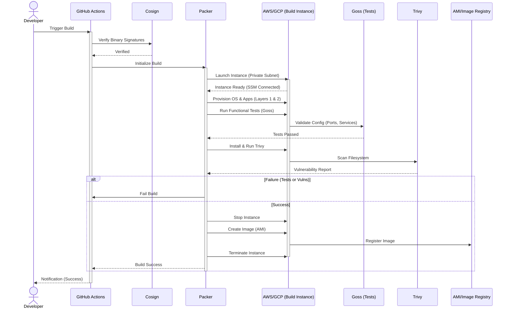

# Automated AMI/Image Pipeline System Design

## 1. Introduction

This document outlines the system design for the Automated AMI/Image Pipeline, a multi-cloud solution to replace manual machine image provisioning for AWS and GCP compute environments.

## 2. Problem Statement

Current operations require manual provisioning of over 32 Compute Groups across AWS (Tokyo, Oregon) and GCP (Tokyo). This process presents several challenges:

  * **Inconsistency:** Manual steps result in configuration drift across environments.
  * **Inefficiency:** Managing 32+ VM groups requires significant manual effort.
  * **Elevated Risk:** Manual builds increase the attack surface and potential for human error.

## 3. Solution: Image as Code (IaC) Pipeline

This solution implements an **Image as Code** pipeline to generate immutable, reproducible machine images from Git-versioned templates.

  * **Goal:** Achieve secure, reproducible builds with a comprehensive audit trail.
  * **Benefit:** Enables rapid patch deployment and ensures consistency across all target platforms.

## 4. Architecture and Infrastructure

### Architecture Overview

The system comprises two primary components:

  * **Part A: Static Foundation (Infrastructure):** Private Subnets, Proxy configuration, and AWS SSM integration.
  * **Part B: Dynamic Process (Workflow):** Layered builds, Packer templates, and artifact signing via Cosign.

### AWS VPC Infrastructure

The AWS VPC infrastructure establishes a secure, isolated foundation for the automated image build workflow.

  * **Network Isolation:** The build environment is deployed within **isolated private subnets** with **no public IPs**.
  * **Access Control:** Access to build instances is managed exclusively through **AWS Systems Manager (SSM)**, eliminating the need for persistent SSH keys.
  * **Security Controls:** Egress traffic is strictly controlled via proxy configurations.
  * **Data Flow:** CI Runners securely access S3, ECR, and GitHub for necessary artifacts and configurations.
  * **Key Components:**
      * **EC2/CI Runner:** Executes the Packer workflow.
      * **Proxy:** Manages network traffic and controls access to external resources.

### Layered "Golden AMI" Strategy

The image build process utilizes a layered approach to enhance consistency, reusability, and maintainability:

  * **Layer 1: Base OS:** Includes Ubuntu, foundational security patches, CIS Hardening, Docker Runtime, and necessary drivers (e.g., NV driver). Vulnerability updates require rebuilding only this layer.
  * **Layer 2: Application:** Contains application-specific components, including Go binaries, container images, and configurations.

## 5. Build Workflow and Tools

### Core Tools

| Tool               | Purpose                                                                                                                                  |
| :----------------- | :--------------------------------------------------------------------------------------------------------------------------------------- |
| **Packer**         | Automated Image Building. Defines the image source, provisioners (e.g., Shell), and target builders (AWS/GCP) via a single HCL template. |
| **Cosign**         | Artifact Signature Verification. Used to sign and verify Go binaries against a key stored in KMS, mitigating supply chain attacks.       |
| **GitHub Actions** | CI/CD Runner. Manages and automates the build workflow lifecycle.                                                                        |
| **Goss**           | Functional Testing. Validates server configuration (ports, services, file permissions) via simple YAML definitions.                      |
| **Trivy**          | Security Scanner. Performs vulnerability scanning during the build phase.                                                                |

### Build Workflow

The workflow, typically triggered manually by the development team, follows a staged process:

1.  **Verification:** Validates binary signatures (Cosign) for application components.
2.  **Provisioning:** Packer executes configuration scripts to install the OS and applications, generating a machine image.
3.  **Functional Testing:** **Goss** validates the running state of the instance (e.g., services up, ports listening) to ensure operational readiness.
4.  **Vulnerability Scan:** Trivy scans the newly provisioned image for vulnerabilities.
5.  **Artifact Generation:** The final image is registered, and temporary resources are cleaned up.

### Functional Validation

To ensure operational readiness, the pipeline employs a "fail-fast" validation strategy using **Goss**. This step verifies that the provisioned image is not just secure, but also functional.

*   **Scope:**
    *   **Service Health:** Verifies critical services (e.g., `nginx`, `docker`) are enabled and running.
    *   **Network:** Confirms required ports (e.g., 80, 443) are listening and reachable locally.
    *   **Configuration:** Validates file permissions, user groups, and kernel parameters match expected state.
*   **Process:** Tests run directly on the build instance. If any test fails, Packer aborts the build immediately, preventing the creation of a defective AMI.

### Multi-Cloud Implementation

Packer utilizes a single HCL template to build images simultaneously for multiple cloud platforms. This ensures a single source of truth for both AWS (via `amazon-ebs`) and GCP (via `googlecompute`), guaranteeing configuration parity.
