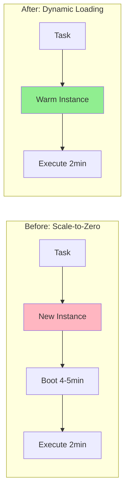
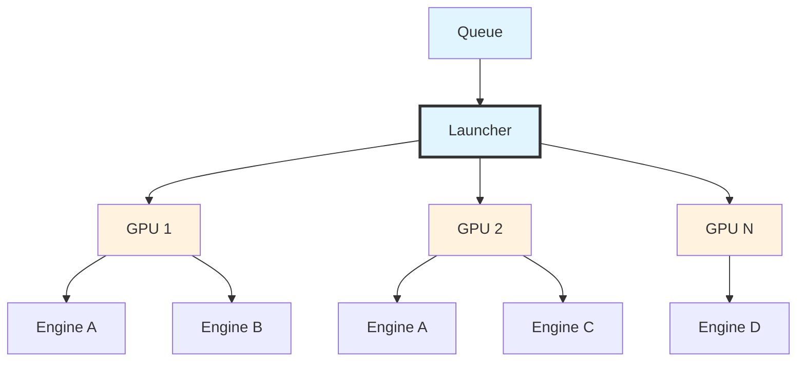
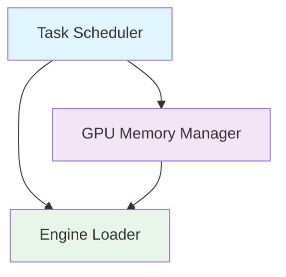
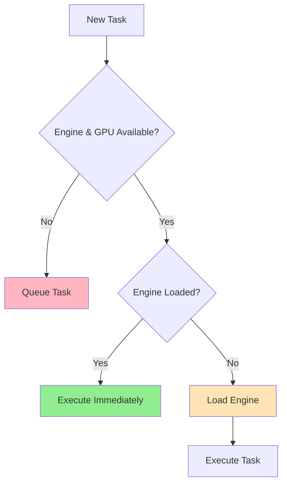
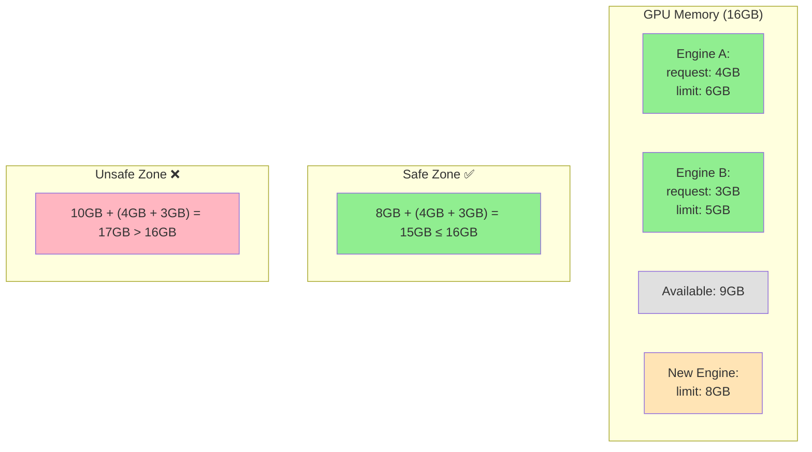
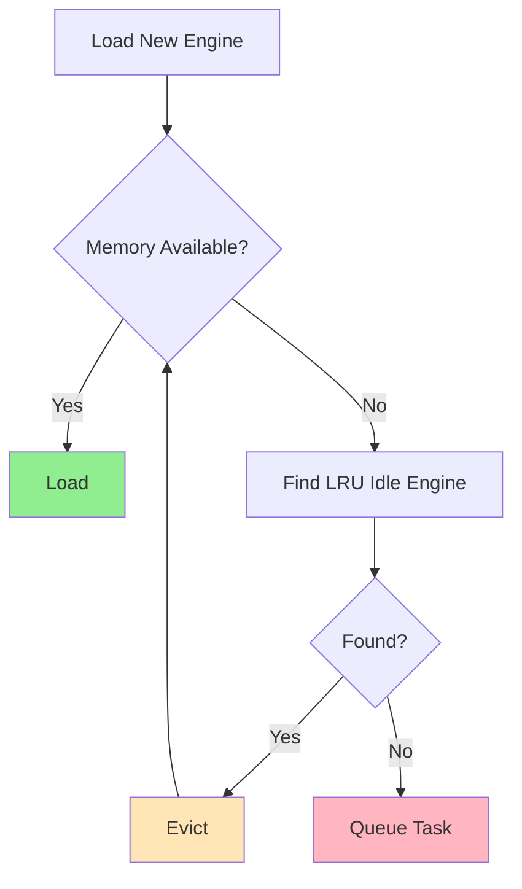

# Dynamic GPU Model Management

## Outline

1. Problem & Solution
2. System Architecture
3. Implementation Details

---

## Problem: L40s Shortage Causes Complete Outages

**Current State:**
- Autoscaling group min size = 0 (scale-to-zero)
- Cold start every task – 4-5min cold start + 2min execution
- Complete outages during L40s shortage

**Critical Impact:**
- Zero availability during hardware shortage
- 67% overhead (5min startup / 7min total)
- 2.5x performance penalty

---

## Solution: Persistent Instances + Dynamic Engine Loading

**Architecture Shift:**
- Warm instances (min size > 0)
- Multiple engines per autoscaling group
- Dynamic engine loading/unloading

**Key Benefits:**
- Hardware shortage resilience
- 67% latency reduction
- Better resource utilization



---

## System Architecture



## Three Core Components:**

**Task Scheduler**
- Routes tasks to optimal GPU/engine pairs

**GPU Memory Manager**
- Admission control
- Engine eviction when memory insufficient

**Engine Loader**
- Handles engine lifecycle (load/unload/execute)
- Manages per-GPU engine inventory
- Coordinates with memory manager for safe operations



---

## Scheduling Algorithm

**Prerequisite:** Engine and GPU both available

**Selection Priority:**
1. **Resident engines** → 0ms execution
2. **Non-resident engines** → ~30s loading overhead  

**Optimization:** Prefer loaded engines to avoid 30s penalty



---

## Memory Management: Admission Control

**Safety Rule:**
```
Can Load Engine? 
= New Engine Limit + Sum(Loaded Engines Request) ≤ GPU Memory
```

**Example:**
```
8GB + (4GB + 3GB) = 15GB ≤ 16GB ✅ Safe
10GB + (4GB + 3GB) = 17GB > 16GB ❌ Unsafe
```

**Design Rationale:**
- Use `request` for loaded engines (guaranteed baseline)
- Use `limit` for incoming engine (worst-case scenario)
- Prevents OOM while maximizing utilization



---

## Memory Management: Eviction Strategy

**LRU Eviction Process:**
1. **Find** least recently used idle engine
2. **Unload** engine from GPU memory  
3. **Repeat** until new engine can be loaded



**Why LRU?**
- Only evicts idle engines (safety first)
- Assumes older = less likely to be needed
- Keeps hot engines loaded for fast access

**Trade-offs:**
- ✅ Efficient memory utilization
- ⚠️ Reload penalty for evicted engines (~30s)
- 🎯 Optimizes for common access patterns

---

## Engine Load/Unload Implementation

**Container-based Engine Lifecycle:**
- **Engine Load** → Container start
- **Engine Unload** → Container stop

**Benefits:**
- Clean memory isolation per engine
- Reliable resource cleanup
- Leverages existing container orchestration

---

## Autoscaling Policy Optimization

**Current:** Scale out when queue length ≥ 1
**Proposed:** Scale out when queue length ≥ 2

**Why Change?**
- Let warm instances handle short bursts
- Reduce unnecessary instance provisioning
- Lower cost while maintaining SLA

**Impact:** Better resource efficiency, reduced scaling churn

---

## Monitoring & Success Metrics

**Core Algorithm Metrics:**
- **Cache Hit Rate** → >80% (scheduler effectiveness)
- **Engine Reload Rate** → <20% (load/unload efficiency)
- **GPU Memory Utilization** → 70-85% (admission control balance)

**Business Impact:**
- **Service Availability** → 99.9%+ (eliminates outages)
- **P95 Latency** → <3min (vs 7min baseline)
- **Cost per Task** → 40% reduction (better utilization)

**Alert Thresholds:**
- Cache hit <60% → Review scheduling logic
- Memory >90% → Tune admission control
- Reload rate >40% → Adjust eviction policy
