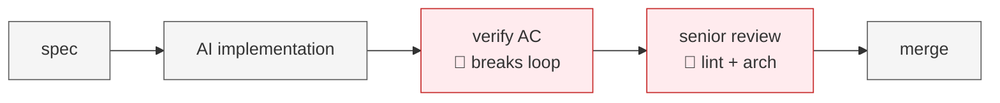
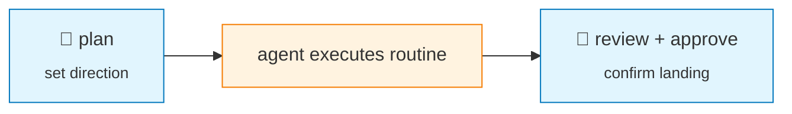
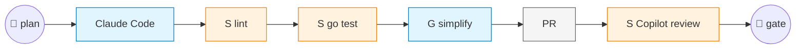

# Harness Engineering

### Focus humans on steering. Send routine to harness.

*Based on writing by OpenAI · Martin Fowler · HumanLayer*

---

## Part 1 — The framework

---

# Harness Engineering

### Velocity AND quality — for AI coding

*Part 1 — framework · Part 2 — 8-day real-repo install*

---

# Today: humans gate the routine



> Failures don't live in the model. They live in the harness.

---

# Humans steer. Agents execute.

— **OpenAI**



---

# `Harness = Sensor + Guide + Tool`

```
              Triad — pick by pain, not strict sequence

  ┌─ Sensor ───────────────┐  ┌─ Guide ─────────────────┐  ┌─ Tool ──────────────┐
  │ Gate agent's output    │  │ Encode senior judgment  │  │ Equip the agent     │
  │ build · lint · test    │  │ style · runbooks · ADRs │  │ browser · observ.   │
  └────────────────────────┘  └─────────────────────────┘  └─────────────────────┘
```

---

# Sensor failure must include `Fix:`

❌ **Without `Fix:`**
```
error: import
constraint violated
```

✅ **With `Fix:`**
```
Architecture violation: Domain must not import
Application (orchestration).

Fix: Define required interfaces in
internal/application/gateway.go and pass as arguments.
```

— Fowler / OpenAI

---

# Behaviour is the elephant: AI tests share prior with AI impl

| Behaviour sensor | Why not enough |
|---|---|
| AI-generated tests | Shared prior with impl — fails together |
| Manual testing | The target is to *reduce* it, not lean on it |

> "Puts a lot of faith into AI-generated tests, that's not good enough yet."
>
> — **Martin Fowler**

---

<!-- Pure visual: full-screen terminal-style screenshot of aol-agent-api repo tree. Black background, white monospace. Zero text overlay. -->

---

## Part 2 — How a real Go repo fills this framework

---

# A small repo — every harness piece visible

**`aol-agent-api`** — Go API for ChatGPT custom GPTs

```
.
├── AGENTS.md
├── CLAUDE.md
├── docs/
├── internal/
├── cmd/
├── api/
└── ...
```

---

# 8 days to install the full harness

**8 days · 92 commits · all installed by agent**

| GUIDE | SENSOR | TOOL |
|---|---|---|
| `AGENTS.md` | `depguard` | `LocalStack` |
| `ARCHITECTURE.md` | `golangci-lint × 6` | |
| `TESTING.md` | **`go test`: 0 → 87 tests** | |
| `WORKFLOW.md` | E2E/smoke test | |
| 10 ADRs | | |

> Guide + Sensor heavy.

---

# AGENTS.md is an index, not an encyclopedia `[GUIDE]`

```
                                          docs/
## System Context                         ├── ARCHITECTURE.md
* Architecture: @docs/ARCHITECTURE.md     ├── TESTING.md
* Testing: @docs/TESTING.md               ├── WORKFLOW.md
                                          ├── architecture-decision-record/
## Workflow                               │   └── ADR-001 ... ADR-010
See @docs/WORKFLOW.md.                    └── guides/
                                              ├── add-use-case.md
                                              └── add-workflow-step.md
```

> OpenAI ~100 lines · HumanLayer < 60 lines · **ours: 6 lines**

---

# Decisions, checked into the repo `[GUIDE]`

**ADR-006: Refactor to Pragmatic Clean Architecture**

| Concept | Unified term | Description |
|---|---|---|
| Entity, Model | **Entity** | Core business objects — `internal/domain/` |
| Interactor, UseCase | **UseCase** | App-specific business logic — `internal/application/` |
| Port, Repository | **Gateway (Interface)** | Boundary contracts — `internal/application/gateway.go` |
| Implementation | **Gateway (Provider)** | Concrete impls — `internal/adapter/gateway/` |
| Handler, Controller | **Controller** | Inbound systems — `internal/adapter/controller/` |

---

# `ARCHITECTURE.md`'s prose → `depguard`'s lint `[SENSOR]`

```yaml
# .golangci.yml — depguard, scoped to internal/domain
domain:
  deny:
    - pkg: "aol-agent-api/internal/application"
      desc: "Architecture violation: Domain must not
            import Application (orchestration).
            Fix: Define required interfaces in
            internal/application/gateway.go and
            pass as arguments."
```

```
cmd  →  adapter  →  application  →  domain
```

---

# `WORKFLOW.md` — documented once, re-read every task `[GUIDE]`

```
WORKFLOW.md (in-repo)
─────────────────────────────
1. Develop  — Tidy-first → Red/Green TDD
2. Test     — Follow @docs/TESTING.md
3. Commit   — One concern per commit, Conventional Commits,
              only after lint clean + tests green
```

---

# 🔴 LIVE DEMO — Sensor catches the violation, live

**Task**: implement AIFaceSwap via TDD

**Watch**: inject a violation → 🚨 depguard fires `Architecture violation: ... Fix: ...`

---

# Closed loop = G + S + T running together



> The closed loop is **not a new component**. It's what **G + S + T compose** — an emergent system.

---

# Harness is a spectrum. We're early.

|  | **What we have** | **What's missing** |
|---|---|---|
| **SENSOR** | `golangci-lint`, `go test`, Copilot review | • No CI lifecycle gate (sensors run only locally)<br>• Multi-agent code review (no auto-promote of Copilot comments) |
| **GUIDE** | `AGENTS.md`, ADRs, `ARCHITECTURE.md` / `TESTING.md` / `WORKFLOW.md` | — |
| **TOOL** | shell · `cmd/myedit_cli` · `cmd/api` · LocalStack | • Agent-queryable observability |

---

# 3 takeaways + Q&A

### 1. **Humans steer. Agents execute.**
> Plan upstream, review/approve downstream. Routine goes to harness.

### 2. **3-step install: Sensor + Guide + Tool**
> Sensor is primary; pick by pain. (Failure messages include `Fix:`; AGENTS.md = index.)

### 3. **Captured once, enforced continuously**
> Every recurring review correction → promote to lint or doc.

---

# Sources

- **OpenAI** · Ryan Lopopolo
  [openai.com/index/harness-engineering](https://openai.com/index/harness-engineering/)
- **Martin Fowler**
  [martinfowler.com/articles/harness-engineering.html](https://martinfowler.com/articles/harness-engineering.html)
- **HumanLayer**
  [humanlayer.dev/blog/skill-issue-harness-engineering-for-coding-agents](https://www.humanlayer.dev/blog/skill-issue-harness-engineering-for-coding-agents)

---

**Open for questions.** 🙋
