# MyEdit CloudFront System Design

## Objective
Improve website performance and reduce Largest Contentful Paint (LCP) by using Amazon CloudFront while maintaining current EC2-based static asset hosting with optimized caching and compression.

## Current Architecture
- Traffic flow: ALB → nginx (static assets) → API server, all in ap-northeast-1
- Website and API share the same domain
- Static assets located under `/static/*` path
- Website is a Single Page Application (SPA)
- Static assets have no Cache-Control or Expires headers, but Etag and Last-Modified are enabled
- Users mainly in US and Japan

## Requirements
- Keep static assets on EC2 (no S3 migration)
- Cache static assets with Smart TTL strategy:
  - nginx controls Cache-Control headers (CloudFront respects origin headers)
  - Flexible TTL: 0 seconds to 1 year based on nginx configuration
  - Query string versioning support (v, version, hash parameters)
- Never cache HTML files (for SPA routing)
- Never cache API responses
- nginx controls all caching and security headers
- Enable Brotli + gzip compression with pre-compressed file support
  - nginx serves pre-compressed `.br` and `.gz` files when they exist
  - nginx compresses in real-time when pre-compressed files don't exist
  - CloudFront compression enabled as fallback
- Configure CloudFront custom domain with SSL certificate

## High-Level Design

```mermaid
graph TB
    %% User Traffic Flow
    Users[👥 Users<br/>US & Japan] --> CF[🌐 CloudFront<br/>Edge Locations]
    CF --> REC[🏢 Regional Edge<br/>Caches]
    REC -->|Cache Miss| OS[🛡️ Origin Shield<br/>ap-northeast-1]
    OS --> ALB[⚖️ Application<br/>Load Balancer]
    
    %% Origin Infrastructure
    ALB --> nginx[🔧 nginx Server]
    nginx -->|Static Assets| FS[💾 File System<br/>EC2]
    nginx -->|Dynamic Requests| API[🔌 API Server]
    
    %% Cache Behaviors
    subgraph CB ["📋 Cache Behaviors"]
        B1["/static/*<br/>🟢 Smart Caching<br/>0s - 1y TTL"]
        B2["/*.html<br/>🔴 No Cache<br/>SPA Routing"]
        B3["Default (*)<br/>🔴 No Cache<br/>API Requests"]
    end
    
    %% Origin Configuration
    subgraph OC ["⚙️ Origin Configuration"]
        O1[🎯 Custom Origin: ALB]
        O2[📦 Brotli + Gzip<br/>Compression]
        O3[🛡️ Origin Shield<br/>ap-northeast-1]
    end
    
    %% Styling
    classDef userNode fill:#e1f5fe,stroke:#01579b,stroke-width:2px
    classDef cloudfront fill:#fff3e0,stroke:#e65100,stroke-width:2px
    classDef origin fill:#f3e5f5,stroke:#4a148c,stroke-width:2px
    classDef cache fill:#e8f5e8,stroke:#1b5e20,stroke-width:2px
    classDef noCache fill:#ffebee,stroke:#b71c1c,stroke-width:2px
    
    class Users userNode
    class CF,REC,OS cloudfront
    class ALB,nginx,FS,API origin
    class B1 cache
    class B2,B3 noCache
```



## CloudFront Configuration

### Distribution Settings
- **Origin Domain**: Your ALB domain name
- **Origin Protocol Policy**: HTTPS Only
- **Viewer Protocol Policy**: Redirect HTTP to HTTPS
- **Compress Objects Automatically**: Yes
- **Price Class**: Use All Edge Locations (for US/Japan coverage)
- **Origin Shield**: Enabled (ap-northeast-1)

### Cache Behaviors (in priority order)

**1. Static Assets - Consolidated Pattern**
```
Path Pattern: /static/*
Cache Policy: CachingOptimized-Versioning (Custom - see configuration below)
Origin Request Policy: CORS-CustomOrigin (Managed: 59781a5b-3903-41f3-afcb-af62929ccde1)
Response Headers Policy: None
```

**2. HTML Files - No Cache**
```
Path Pattern: *.html
Cache Policy: CachingDisabled (Managed: 4135ea2d-6df8-44a3-9df3-4b5a84be39ad)
Origin Request Policy: AllViewer (Managed: 216adef6-5c7f-47e4-b989-5492eafa07d3)
Response Headers Policy: None
```

**3. Default Behavior - No Cache**
```
Path Pattern: Default (*)
Cache Policy: CachingDisabled (Managed: 4135ea2d-6df8-44a3-9df3-4b5a84be39ad)
Origin Request Policy: AllViewer (Managed: 216adef6-5c7f-47e4-b989-5492eafa07d3)
Response Headers Policy: None
```

## Policy Configurations

### Custom Cache Policy for Static Assets

**CachingOptimized-Versioning**
```json
{
  "CachePolicyConfig": {
    "Name": "CachingOptimized-Versioning",
    "Comment": "Optimized caching with query string versioning support, exclude cookies for better cache hit rate",
    "DefaultTTL": 86400,
    "MaxTTL": 31536000,
    "MinTTL": 0,
    "ParametersInCacheKeyAndForwardedToOrigin": {
      "EnableAcceptEncodingGzip": true,
      "EnableAcceptEncodingBrotli": true,
      "QueryStringsConfig": {
        "QueryStringBehavior": "whitelist",
        "QueryStrings": {
          "Items": ["v", "version", "hash"]
        }
      },
      "HeadersConfig": {
        "HeaderBehavior": "none"
      },
      "CookiesConfig": {
        "CookieBehavior": "none"
      }
    }
  }
}
```

**Custom Cache Policy Behavior:**
- When origin sends `Cache-Control: max-age=31536000`, CloudFront caches for 1 year
- When origin sends `Cache-Control: max-age=3600`, CloudFront caches for 1 hour
- When origin sends `Cache-Control: no-cache`, CloudFront respects it and doesn't cache (TTL = 0)
- When origin sends no Cache-Control header, CloudFront uses DefaultTTL (86400s = 24 hours)
- MinTTL=0 ensures CloudFront always respects origin's no-cache directives
- MaxTTL=31536000 caps the maximum cache duration at 1 year

**Key Benefits of Custom Policy:**
- Includes query strings (v, version, hash) for versioning support
- Excludes cookies to maximize cache hit rate
- Respects origin Cache-Control headers for flexible TTL (0s - 1y)
- Supports Brotli and Gzip compression

## Origin Configuration with Shield

```json
{
  "Origins": {
    "Items": [
      {
        "Id": "primary-alb",
        "DomainName": "your-alb-domain.ap-northeast-1.elb.amazonaws.com",
        "CustomOriginConfig": {
          "HTTPPort": 80,
          "HTTPSPort": 443,
          "OriginProtocolPolicy": "https-only",
          "OriginSslProtocols": {
            "Items": ["TLSv1.2"]
          }
        },
        "OriginShield": {
          "Enabled": true,
          "OriginShieldRegion": "ap-northeast-1"
        }
      }
    ]
  }
}
```

### AWS CLI Commands

**Create Custom Cache Policy:**
```bash
aws cloudfront create-cache-policy \
  --cache-policy-config '{
    "Name": "CachingOptimized-Versioning",
    "Comment": "Optimized caching with query string versioning support, exclude cookies for better cache hit rate",
    "DefaultTTL": 86400,
    "MaxTTL": 31536000,
    "MinTTL": 0,
    "ParametersInCacheKeyAndForwardedToOrigin": {
      "EnableAcceptEncodingGzip": true,
      "EnableAcceptEncodingBrotli": true,
      "QueryStringsConfig": {
        "QueryStringBehavior": "whitelist",
        "QueryStrings": {
          "Items": ["v", "version", "hash"]
        }
      },
      "HeadersConfig": {
        "HeaderBehavior": "none"
      },
      "CookiesConfig": {
        "CookieBehavior": "none"
      }
    }
  }'
```

## Required nginx Configuration Updates

```nginx
# Global compression settings - CloudFront will compress if origin doesn't
gzip on;
gzip_vary on;
gzip_types
    text/plain
    text/css
    text/xml
    text/javascript
    application/javascript
    application/json
    application/xml
    application/rss+xml
    application/atom+xml
    image/svg+xml;

# Brotli compression types for pre-compressed file support
brotli_types
    text/plain
    text/css
    text/xml
    text/javascript
    application/javascript
    application/json
    application/xml
    application/rss+xml
    application/atom+xml
    image/svg+xml;

# Static assets: Long cache + security headers + pre-compressed support
location /static/ {
    # Cache for 1 year
    add_header Cache-Control "public, max-age=31536000, immutable";
    add_header Vary "Accept-Encoding";
    
    # Security headers
    add_header X-Content-Type-Options "nosniff" always;
    add_header X-Frame-Options "DENY" always;
    add_header X-XSS-Protection "1; mode=block" always;
    add_header Referrer-Policy "strict-origin" always;
    
    # Serve pre-compressed files if available
    gzip_static on;
    brotli_static on;
}

# HTML files: Never cache + security headers for SPA routing
location ~* \.html$ {
    # Prevent all caching
    add_header Cache-Control "no-cache, no-store, must-revalidate";
    
    # Security headers for HTML pages
    add_header X-Content-Type-Options "nosniff" always;
    add_header X-Frame-Options "DENY" always;
    add_header X-XSS-Protection "1; mode=block" always;
    add_header Referrer-Policy "strict-origin" always;
    add_header Content-Security-Policy "default-src 'self'; script-src 'self' 'unsafe-inline'; style-src 'self' 'unsafe-inline'; img-src 'self' data:; font-src 'self'" always;
    add_header Strict-Transport-Security "max-age=31536000; includeSubDomains" always;
}

# Default: SPA routing + API fallback + no cache
location / {
    # Prevent caching for dynamic content and SPA routes
    add_header Cache-Control "no-cache, no-store, must-revalidate";
    
    # Try file, then directory, then fallback to API server
    try_files $uri $uri/ @backend;
}

# API server proxy (handles dynamic requests and SPA fallback)
location @backend {
    proxy_pass http://api_server;
    # Note: API server should set its own security headers
}
```

## Asset Organization Requirements

Reorganize static assets into the following directory structure:

```
/static/
├── js/
│   ├── app.js
│   ├── app.js.gz (pre-compressed)
│   ├── app.js.br (pre-compressed)
│   ├── vendor.js
│   └── ...
├── css/
│   ├── main.css
│   ├── main.css.gz (pre-compressed)
│   ├── main.css.br (pre-compressed)
│   └── ...
├── images/
│   ├── logo.png
│   ├── icons/
│   └── ...
└── fonts/
    ├── font.woff2
    └── ...
```

## Key Benefits

1. **Performance**: Static assets cached at edge locations with Origin Shield reducing origin load
2. **Compression**: Brotli + gzip compression with pre-compressed file support
3. **Smart Caching**: Origin-controlled TTL (0 seconds minimum, up to 1 year max) with nginx Cache-Control headers
4. **SPA Support**: HTML files always fresh for proper routing
5. **API Integrity**: API responses never cached, ensuring real-time data
6. **Cost Efficiency**: Origin Shield reduces origin requests by 15-25%

## Cost Analysis

### CloudFront Pricing Model (First 10TB Tier)

| Component | Rate | Billing Unit |
|-----------|------|--------------|
| Data Transfer Out - US | $0.085/GB | Per GB transferred |
| Data Transfer Out - JP | $0.114/GB | Per GB transferred |
| HTTPS Requests - US | $0.010/10K | Per 10,000 requests |
| HTTPS Requests - JP | $0.012/10K | Per 10,000 requests |
| Data Transfer OUT To CloudFront | $0.000/GB | No additional charge |
| Regional Data Transfer Out to Origin | $0.060/GB | Per GB on cache miss |

### Traffic Flow Cost Analysis

| Traffic Pattern | Baseline (Direct ALB) | CloudFront Architecture | Delta |
|-----------------|----------------------|-------------------------|-------|
| Static Assets → US Users | $0.114/GB | $0.085/GB + $0.060/GB × (1-CHR) + request fees | -20.2% at 90% CHR |
| Static Assets → JP Users | $0.114/GB | $0.114/GB + $0.060/GB × (1-CHR) + request fees | +5.3% at 90% CHR |
| Dynamic Content → All Users | $0.114/GB | $0.114/GB + CloudFront overhead | +2-5% overhead |

*CHR = Cache Hit Ratio*

## Implementation Notes

- CloudFront has a limit of 75 cache behaviors per distribution - plan behavior patterns accordingly
- Use versioned filenames for static assets (e.g., `app.v123.js`) to enable long caching
- Pre-compress static assets during build process for optimal performance
- Update build processes to output assets to the new directory structure and generate pre-compressed files
- Test SPA routing thoroughly after implementation
- Monitor CloudFront cache hit ratios to optimize path patterns
