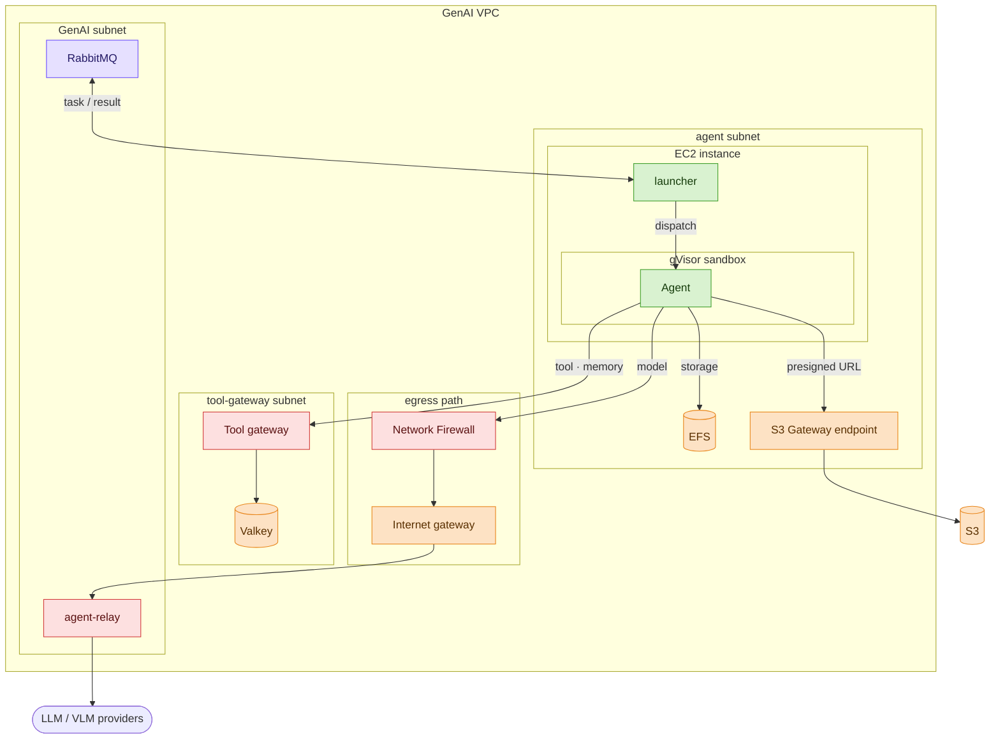
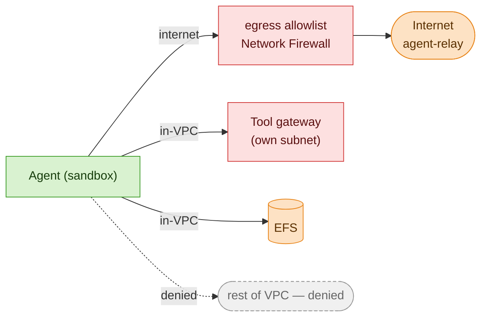
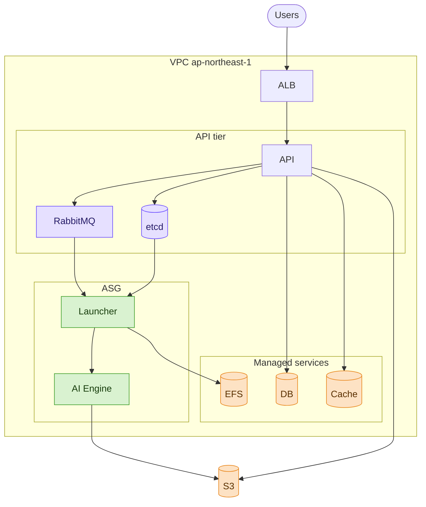

# Remotion Agent — Cloud Security Architecture Review

Audience: Mixed engineering + management; most attended the prior architecture meeting.

---

## Slide 1 — Agreed direction & today's decision

**Agreed last meeting**
- **Isolation** sandbox + container · ephemeral per turn
- **Access** LLM (Claude) + VLM via proxy (agent-relay) · per-turn token
- **Egress** default-deny · proxy only
- **Session memory** · isolated per session

**Decision today** sign off the proposed architecture

Speaker note: The prior architecture meeting agreed this direction: isolation, access, egress, and session memory. This proposal secures each item — the five-layer defense on slide 3, then the per-item detail on slides 4–9. The decision requested is sign-off on the architecture. Egress (Option B vs C) is the only open part; the rest is endorsed as proposed. IMDS = instance metadata service, the endpoint that issues the instance IAM role. gVisor = a user-space kernel between the container and the host.

---

## Slide 2 — Proposed architecture

Speaker note: This diagram is the reference model; each later slide opens one part of it. The current shared VPC cannot contain the three threat-model risks: internal services accept any in-VPC caller, so they cannot refuse the agent. Valkey holds session memory, reached only through the tool gateway; large files stay on EFS (detail on slide 8). The boundary is the agent's outbound path, not the services it might reach: host firewall rules sit inside the area a compromise can reach, so containment moves to control-plane objects at the subnet edge. Mechanism: existing Security Groups allow inbound `10.0.0.0/8` and cannot express DENY. The egress path is drawn with the recommended Option C (Network Firewall); Option B is the same diagram with a Squid proxy (the slide-7 decision). The before/after diagram is in the appendix.

---

## Slide 3 — Defense-in-depth — five layers

| Layer | Protects by |
|---|---|
| 1 · Isolation | gVisor around the sandbox |
| 2 · IMDS | disabled, no instance role |
| 3 · Credentials | gateways hold the real secrets |
| 4 · Domain allowlist | default-deny, allowed domains only |
| 5 · Network | subnet allowlist on outbound traffic |

Speaker note: No single layer is the boundary. Each layer holds even if another fails, so a gVisor escape — low-probability, but not impossible — does not by itself break containment. gVisor = a user-space kernel between the container and the host.

The layers are not interchangeable. The domain allowlist (layer 4) can be bypassed on its own, because a client can lie about the TLS SNI / HTTP Host name it presents. The network allowlist (layer 5) sits beneath it for exactly this reason: it limits which subnets and IPs the agent can reach at all, regardless of the hostname it claims.

---

## Slide 4 — Sandbox isolation & zero-credential

**Isolation** gVisor sandbox · new one per turn · launcher on host

**Docker Hardening** non-root · read-only root FS · cap-drop ALL

**Credentials** no IAM role · IMDS disabled · only the per-turn token

*Agreed last meeting: isolation*

Speaker note: Isolation strength is proposed for endorsement; the prior meeting agreed only to use a sandbox, not this specific hardening.

Why zero-credential rather than least-privilege: the agent runs arbitrary code, so it can complete the instance-metadata handshake legitimately. Whatever the instance role is allowed to do, the attacker can do. The only role that cannot be abused is a role that does not exist.

Why gVisor rather than a plain container: runc has had confirmed container-escape CVEs in 2024–2025 (for example CVE-2024-21626); gVisor had no escapes in the same period — its one CVE, CVE-2025-2713, was a local privilege escalation, not an escape.

Agent developers build and test under these container constraints: non-root, read-only root filesystem, all Linux capabilities dropped, no Docker socket, and the gVisor syscall surface (a subset of Linux).

---

## Slide 5 — Credential mediation

| Component | Holds |
|---|---|
| **Agent sandbox** | **only the per-turn token** |
| Model gateway (agent-relay) | provider API keys |
| Tool gateway | AWS role + tool keys |

*Agreed last meeting: access via proxy + per-turn token*

Speaker note: Every credentialed call is mediated, so real secrets never enter the sandbox. The per-turn token is signed by the GenAI API server when the task is queued, and checked by both gateways against a JWKS key set; one queue message equals one turn. JWKS = the public keys used to verify the token's signature. The tool gateway itself is Envoy plus a thin control plane on Fargate.

There are two S3 paths. A presigned URL — a short-lived, single-object access link — is issued through the tool gateway; the bulk bytes then go straight to the S3 Gateway endpoint and skip the gateways. Session memory (Valkey) takes the same mediated path through the tool gateway (slide 8).

---

## Slide 6 — Egress containment

**Boundary** agent's outbound is a source-side allowlist (not the destination) — everything else denied

*Agreed last meeting: default-deny egress*

Speaker note: This is the egress slice of slide 2. The agent (sandbox) reaches only three places — the tool gateway's subnet, EFS, and the egress path to the internet; every other subnet in the VPC is denied.

The two outbound layers apply in order. Layer 5 (the subnet allowlist, NACL/SG) pins the allowed subnets and IPs and denies the rest of `10.0.0.0/8`; layer 4 (the domain allowlist) then filters which domains the Network Firewall lets out. The domain allowlist is enforced per source subnet. This is why the tool gateway has its own subnet instead of sharing the agent's: in a shared subnet, the agent's allowlist would be the union of both, so every external tool-API domain the gateway needs — a set that only grows — would be reachable directly from the agent. Kept separate, the agent's direct reach stays minimal, and every tool call goes through the gateway, which checks the token and adds the key. The session-memory cache (Valkey) sits behind the gateway the same way, never on the agent's allowlist directly.

RabbitMQ is the launcher's task I/O, not the agent's — the sandbox has no path to it. Appendix A2 has the full instance rules and the reason. DoH (DNS-over-HTTPS) exfiltration is covered on slide 10.

---

## Slide 7 — Egress options — the decision

| | Option B — Squid proxy | Option C — AWS Network Firewall |
|---|---|---|
| Fixed cost | ≈ **$44/mo** — t3.medium (≈ $88 with HA) | ≈ **$288 / month** |
| Operations | self-built Squid · patch, HA | AWS-managed |
| Agent config | proxy variables required | none (transparent) |
| Blocks encrypted-DNS bypass | stronger | weaker |

**Recommendation — Option C** transparent filtering · fully managed · multi-AZ by config · ≈ $288/month

Speaker note: Egress is the only open decision in this proposal. Option C (Network Firewall) filters transparently, so it also catches generated code that ignores proxy settings. It is fully managed and Multi-AZ (across availability zones) by configuration, has no self-built data plane to secure, and can run managed Suricata IPS rules.

Option B has the strongest possible deny: the agent subnet has no internet route at all, so code that ignores the proxy cannot leave. It is also the cheapest. The cost is that we patch, scale, and run high-availability (HA) ourselves, and a single instance is a single point of failure — production HA needs ≥2 instances. B's ≈$44/mo = t3.medium (~$40) + public IP (~$4), ap-northeast-1 on-demand; ≈$88/mo with HA, still well under Option C.

That same property explains the encrypted-DNS row. Option B is stronger against DoH only because it has no default route, so a DoH query to a public resolver has nowhere to go; under Option C the firewall does not inspect that traffic (DoH detail on slide 10).

On cost: the ≈$288/month is the firewall endpoint; the supporting NAT gateway charges are waived (appendix A3 has the breakdown).

Migration from B to C later is a control-plane change only. The remaining slides are the implementation components the dev team builds under this design — no further decisions.

---

## Slide 8 — Session memory (Valkey)

**Store** session state

**Access** via tool gateway · no standing credential · per-session keys isolated

**Limit** cross-session needs a sandbox escape — then one session at a time (slide 10)

*Session memory — small, hot state*

Speaker note: Implementation detail (dev team): session state (conversation state, small hot values) lives in a dedicated Valkey, reached only through the tool gateway. The agent holds no Valkey credential and never connects directly. The tool gateway derives the key prefix (`session:{id}:…`) from the per-turn JWT's `session` claim (the per-turn token, slide 5) and ignores any agent-supplied `session_id`, so a session reads and writes only its own keys and cannot forge another's (it cannot mint a JWT with a different claim). It is a dedicated instance, not the shared GenAI Valkey: a separate keyspace, eviction policy, and security group keep the adversarial agent out of the shared cache's blast radius. Cross-session access is escape-gated. On the normal path the agent reaches only its own session. Reaching another session requires a sandbox escape; only then can host root read a live token and replay it through the tool gateway, and even then it reaches only that one session's keys, with no direct or bulk access, bounded by the token's expiry (slide 10). Large files (workspace artifacts) stay on EFS (slide 9); Valkey holds the small, hot session state.

---

## Slide 9 — Session storage (EFS)

**Store** workspace files

**Access** direct mount (own session dir) · standing mount · per-session dir isolated

**Limit** cross-session needs a sandbox escape — then every session at once (slide 10)

*Session storage — large files*

Speaker note: Implementation detail (dev team): the agent writes only under `/mnt/workspace` (its own EFS session directory, persisted across turns) and the per-turn `tmp` scratch (cleared each task); everything else is read-only. Isolation is the mount namespace: each container bind-mounts only its own `/mnt/efs/sessions/<id>`, so there is no in-container path to another session's directory, and `cap-drop ALL` (CAP_SYS_ADMIN removed) prevents it from remounting the parent. No per-session UID is assigned, so all containers share one UID; the namespace is therefore the only layer between sessions, and if it is crossed, POSIX permissions give no fallback. Cross-session access is escape-gated. On the normal path a session sees only its own directory. Reaching another session requires a sandbox escape: a gVisor escape gives host root, which then reads every session under `/mnt/efs` directly (co-location residual, slide 10).

---

## Slide 10 — Residual risks

| Risk | Bounded by |
|---|---|
| A sandbox breakout would reach other sessions on the shared host | gVisor (breakout is rare); reduce later — one host per session |
| A stolen per-turn token stays valid until it expires | kept short-lived (no mid-life revoke) |
| Data could leak hidden inside an allowed model call | size + rate limits + full logging at agent-relay |

This design limits the **damage** of a compromise — it does not stop prompt injection itself.

Speaker note: Sandbox breakout (co-location) is the widest residual. The agent shares a long-lived, multi-session host with the launcher, so a gVisor escape — low-probability, and only partially mitigated in the threat model — gives host root. With host root, the attacker reaches three things: every session's per-turn token (live tokens also sit in the queued RabbitMQ task payloads); every session's EFS data under `/mnt/efs` (the mount namespace isolates unprivileged containers, not host root); and the ability to forge result-queue messages. It is bounded by AMQP-over-TLS, a least-privilege RabbitMQ user, and a tight token expiry, and reducible later by one host per session, short host lifetime, and signed result-queue messages.

Session memory in Valkey is not in that blast radius directly — it is gateway-mediated, in a separate subnet, with no agent-held credential. But host root can read a live per-turn token and replay it through the tool gateway to reach that one session's keys, so it is bounded, not immune.

Token replay: one token serves many calls in a turn, so it cannot be revoked after first use and stays valid until it expires, from anywhere. Keep the expiry as tight as the queue dwell allows.

Content-level exfiltration: the agent can encode data into an allowed model request and send it out with its legitimate token. The network sees an allowed call, not the content — the sandbox holds, but the data still leaves. It is limited by per-session size and rate caps, full prompt logging at agent-relay, and denying agent-supplied tool/function definitions (which would turn the model into a fetch primitive). DoH (encrypted-DNS) exfiltration also lives here, bounded by the same domain allowlist. Presigned-URL replay is bounded by its short, seconds-level TTL and single-object scope.

Prompt injection is the root cause. This design only limits the blast radius; preventing the injection itself is human review gates plus least-privilege tools.

---

## Slide 11 — Decision summary & sign-off

**Sign-off means agreeing to**
1. the proposed design — gVisor sandbox · zero-credential · two gateways · per-turn token · Valkey + EFS
2. egress — AWS Network Firewall
3. the residual risks

**Not today** — agent-on-Fargate

**The ask** — review · flag any changes · sign off

Speaker note: Egress is the only decision that must be made in this review; everything else is endorsement and acceptance of the residual risks. The deferred target is the separate VPC and the Fargate move, which removes the co-location residual.

---

## Appendix A1 — Current architecture

Speaker note: The current GenAI VPC is shared and unsegmented; the agent would run alongside these services with no boundary. The proposal adds the new private agent subnet, the tool gateway, and the egress path.

---

## Appendix A2 — Subnet boundary: Network ACL + Security Group

**Security Group — outbound** (stateful · allow-only; default all-traffic rule removed)

| Type | Protocol | Port | Destination | Description |
|---|---|---|---|---|
| NFS | TCP | 2049 | EFS mount target | mount |
| Custom TCP | TCP | 5671 | RabbitMQ | AMQPS |
| HTTPS | TCP | 443 | 0.0.0.0/0 | internet + in-VPC 443 — NFW filters domains; NACL pins internal |

**Network ACL — outbound** (stateless · evaluated by rule #)

| # | Type | Protocol | Port | Destination | Allow/Deny |
|---|---|---|---|---|---|
| 100 | NFS | TCP | 2049 | EFS mount target /32 | Allow |
| 110 | Custom TCP | TCP | 5671 | RabbitMQ /32 | Allow |
| 120 | HTTPS | TCP | 443 | tool-gateway subnet CIDR | Allow |
| 200 | Custom UDP | UDP | 443, 80 | 0.0.0.0/0 | Deny (QUIC) |
| 300 | All traffic | All | All | 10.0.0.0/8 | Deny |
| 400 | HTTPS | TCP | 443 | 0.0.0.0/0 | Allow (→ firewall) |

Speaker note: Network ACL = subnet firewall (stateless — it needs matching inbound rules for the ephemeral return ports 1024–65535); Security Group = instance firewall (stateful, allow-only).

NACL order matters. The in-VPC allows (100–120) and the QUIC + `10.0.0.0/8` denies (200, 300) come before the broad internet allow (400), so the agent reaches only EFS, RabbitMQ, and the tool-gateway subnet internally — every other internal host is denied — while internet 443 is allowed and routed to the firewall. Neither layer can match domains: under Option C the route sends `0.0.0.0/0` to the Network Firewall, which enforces the domain allowlist.

Because the SG then allows `443 → 0.0.0.0/0`, separate 443 SG rules to the tool gateway or S3 would be redundant — the NACL's exact rules (100–120), not the SG, pin which internal hosts the agent reaches on 443. (S3 still routes to the Gateway endpoint via its prefix-list route, not the firewall.) Under Option B there is no default route, so the SG becomes a tight allowlist instead — `443 → Squid proxy SG · tool-gateway SG · S3 prefix list`, with no `0.0.0.0/0` — reaching the no-fixed-IP tool gateway by SG-to-SG reference plus Cloud Map DNS.

The allowlist is instance-level: the launcher and the sandbox share one ENI (the instance's single network interface), so SG and NACL cannot tell them apart. The sandbox's inability to reach RabbitMQ therefore rests on gVisor, not on the firewall (slide 10). Ports and rule numbers are illustrative.

---

## Appendix A3 — Option C cost

**Option C — added egress cost** (ap-northeast-1)

| Item | Cost |
|---|---|
| Network Firewall endpoint | $0.395/h ≈ **$288 / month** |
| Traffic processed | + $0.065 / GB |
| NAT gateway | per-hour & per-GB **waived** — same service chain as Network Firewall |
| S3 bulk bytes | off this path — via S3 Gateway endpoint |

Speaker note: The firewall endpoint is effectively the only added egress cost — the NAT gateway's standard per-hour and per-GB charges are waived when it sits in the same service chain as Network Firewall, and S3 bulk bytes bypass the path via the Gateway endpoint, so processed volume is mainly model calls and package installs.
