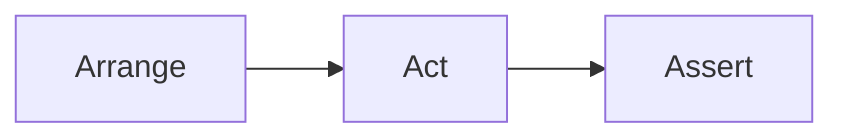

## What We'll Cover

- Testing fundamentals and principles
- Go testing toolkit and patterns
- Dependency isolation with test doubles  
- AI-powered test creation

**Speaker's Memo:**
*Opening hook: "How many of you have been burned by a production bug that could have been caught with a simple test?" Pause for engagement. Set expectations: this isn't testing theory—it's practical patterns you'll use Monday morning. Emphasize the AI component as the modern twist that makes testing faster and more comprehensive. Time: 1 minute.*

---

## What is Unit Testing

**Definition**: Automated code that tests a single unit of work and validates one specific behavior

**Why it matters**: Faster feedback, safer refactoring, living documentation

**Speaker's Memo:**
*Start with the definition but immediately pivot to value. Ask: "What's the cost of a bug in production vs. development?" Emphasize the 10x-100x cost multiplier. Connect to their pain points: "How many times have you been afraid to refactor because you weren't sure what would break?" Position unit tests as confidence builders, not just bug catchers. Time: 2 minutes.*

---

## The F.I.R.S.T. Principles
**Fast** - Milliseconds, not seconds  
**Independent** - No test dependencies or ordering  
**Repeatable** - Same result in any environment  
**Self-Validating** - Clear pass/fail, no manual log analysis
**Timely** - Written before or with production code  

*Why it matters: Slow, flaky, or unclear tests kill developer productivity*

**Speaker's Memo:**
*This is the foundation slide—spend time here. Go through each principle with real examples: "Fast means your entire test suite runs in under 30 seconds, not 30 minutes." For Independent: "If TestA must run before TestB, you're doing integration testing, not unit testing." For Repeatable: "Works on your machine, CI, and your colleague's Windows laptop." For Self-Validating: "Test output says PASS or FAIL, not 'check the logs for error code 42'." For Timely: "Write tests before you push to main, not after the bug report comes in." Emphasize the productivity killer angle—bad tests are worse than no tests. Time: 3 minutes.*

---

## Test Structure: AAA Pattern
- Arrange → Set up test data and conditions
- Act     → Execute the code under test  
- Assert  → Verify the expected outcome



**Speaker's Memo:**
*Keep this brief—it's a pattern they likely know. Focus on the mental model: "Every test tells a story in three acts." Mention that this pattern makes tests readable by anyone on the team, not just the author. Preview that all upcoming code examples will follow this pattern. Consider showing a bad test without AAA structure as a contrast. Time: 1 minute.*

---

## Go Testing Essentials

**Built-in Tools**:
- `testing` package - Test runner and basic assertions
- `go test` command - Execution and reporting

**Recommended Libraries:**
- `testify/assert` - Readable assertions
- `testify/mock` - Mock generation and verification

**File Naming:** `*_test.go` files in same package
**Function Signature:** `func TestXxx(*testing.T)`

**Speaker's Memo:**
*Highlight Go's philosophy: batteries included but extensible. Emphasize that you can start testing immediately with zero dependencies—just the standard library. Position testify as the community standard, not a requirement. Mention the naming conventions are enforced by the toolchain, not just style guides. Quick note: tests live alongside production code, not in separate directories. Time: 2 minutes.*

---

## Basic Test Example

```go
package main

import "testing"

func TestMyFunction(t *testing.T) {
    // Arrange
    input := "foo"
    expected := "bar"

    // Act
    actual := MyFunction(input)

    // Assert
    if actual != expected {
        t.Errorf("Expected %s; got %s", expected, actual)
    }
}
```

**Key Elements:**
- Function name starts with `Test`
- Takes `*testing.T` parameter
- Uses assertions for validation

**Speaker's Memo:**
*Walk through the code line by line, pointing out the AAA pattern in comments. Emphasize the naming convention—TestXxx is not optional, it's how Go discovers tests. Show how t.Errorf provides context when tests fail. This is vanilla Go—no external dependencies. Mention that this pattern scales from simple functions to complex business logic. Time: 2 minutes.*

---

## Better Assertions with Testify

```go
package main

import (
    "testing"
    "github.com/stretchr/testify/assert"
)

func TestMyFunction(t *testing.T) {
    // Arrange
    input := "foo"
    expected := "bar"

    // Act
    actual := MyFunction(input)

    // Assert
    assert.Equal(t, expected, actual)
}
```

**Why Testify Wins:**
- Readable assertions vs manual conditionals
- Clear failure diffs: `Expected: "bar", Actual: "baz"`
- 50+ assertion methods

**Speaker's Memo:**
*Show the before/after comparison with the previous slide. Highlight the readability improvement—assert.Equal reads like English. Emphasize the failure output quality: testify shows you exactly what went wrong with colored diffs. Mention the breadth: assert.Contains, assert.Nil, assert.Greater, etc. This is where Go testing becomes pleasant instead of verbose. Time: 2 minutes.*

---

## Running Tests

```bash
go test                   # Current package
go test ./...             # All packages recursively
go test -v                # Verbose output
go test -run TestName     # Specific test pattern
go test -cover            # Coverage report
```

**Speaker's Memo:**
*Quick practical slide—show these commands in action if possible. Emphasize `go test ./...` as the most common command for CI/CD. Mention that `-v` is essential for debugging but noisy for regular runs. The `-run` flag uses regex patterns, so `TestUser` matches `TestUserCreate`, `TestUserUpdate`, etc. Coverage is built-in—no external tools needed. Time: 1 minute.*

---

## Organizing Tests: Subtests

```go
func TestValidateEmail(t *testing.T) {
    t.Run("valid email", func(t *testing.T) {
        result := ValidateEmail("user@example.com")
        assert.True(t, result)
    })
    
    t.Run("missing domain", func(t *testing.T) {
        result := ValidateEmail("user@")
        assert.False(t, result)
    })
    
    t.Run("missing @", func(t *testing.T) {
        result := ValidateEmail("userexample.com")
        assert.False(t, result)
    })
    
    t.Run("empty string", func(t *testing.T) {
        result := ValidateEmail("")
        assert.False(t, result)
    })
}
```

**Benefits**: Grouped related tests, clear test names, parallel execution

**Speaker's Memo:**
*This is about test organization at scale. Point out how subtests create a hierarchy: TestValidateEmail/valid_email. Emphasize the descriptive names—they become your test documentation. Mention that each subtest can run independently with `go test -run TestValidateEmail/valid`. The parallel execution benefit comes with `t.Parallel()` in each subtest. This pattern prevents test file explosion. Time: 3 minutes.*

---

## Table-Driven Tests

```go
func TestValidateEmail(t *testing.T) {
    tests := []struct {
        name     string
        email    string
        expected bool
    }{
        {"valid email", "user@example.com", true},
        {"missing domain", "user@", false},
        {"missing @", "userexample.com", false},
        {"empty string", "", false},
    }
    
    for _, tt := range tests {
        t.Run(tt.name, func(t *testing.T) {
            result := ValidateEmail(tt.email)
            assert.Equal(t, tt.expected, result)
        })
    }
}
```

**Benefits**: Easy to add test cases, comprehensive edge case coverage, minimal code duplication

**Speaker's Memo:**
*This is the Go idiom for comprehensive testing. Point out the struct slice pattern—it's everywhere in Go codebases. Emphasize how easy it is to add new test cases: just add another struct to the slice. The `tt` variable name is a Go convention (short for "test table"). Show how this scales: you can test 20 edge cases with minimal code duplication. Time: 3 minutes.*

---

## What to Test: Focus Your Efforts

**Test**
- Public API methods
- Business logic paths
- Complex conditional paths
- Edge cases and error conditions

**Don't test**
- Private methods (test through public interface)
- Third-party library code
- Simple getters/setters

**Speaker's Memo:**
*This is the strategic slide—where to invest testing effort for maximum ROI. Emphasize testing behavior, not implementation details. Private methods change frequently; public APIs are contracts. Don't test what you don't own—trust that AWS SDK works, test how you use it. The getter/setter rule: if there's no logic, there's nothing to break. Focus on the code that makes business decisions. Time: 2 minutes.*

---

## Handling Dependencies

**Problem**: External dependencies slow tests and create flakiness

**Common Dependencies**:
- File systems  
- Databases
- HTTP services
- Time/randomness

**Solution**: Test doubles (mocks, stubs, fakes)

**Speaker's Memo:**
*This is the transition to advanced testing. Start with the pain: "How many of you have tests that fail because the database is down?" External dependencies violate the FIRST principles—they're slow, unrepeatable, and create coupling. List the common culprits they'll recognize. Position test doubles as the solution, not just a technique. This sets up the next slide's deeper dive. Time: 2 minutes.*

---

## Test Doubles Explained

Test Double is a generic term for any case where you replace a production object for testing purposes. (Martin Fowler, “Test Double”)

**Dummy** - Placeholder objects (fill parameter lists)
**Fake** - Working implementation with shortcuts (in-memory DB)
**Stub** - Returns predefined responses
**Spy** - Records how it was called
**Mock** - Pre-programmed with expectations

**Speaker's Memo:**
*Start with Fowler's definition for credibility—this isn't just Go-specific terminology. Go through each type with concrete examples: Dummy is nil or empty struct, Fake is SQLite instead of PostgreSQL, Stub returns hardcoded JSON, Spy tracks call count, Mock fails if not called correctly. Most people use "mock" for everything, but precision matters for debugging. In Go, interfaces make all of these patterns natural. Time: 3 minutes.*

---

## AI-Assisted Testing: GitHub Copilot

**Context is Critical:**
- Target functions/methods in current workspace
- Existing test patterns and conventions
- Team testing guidelines (README, GUIDELINES.md)

**Human Review Essential:**
- Verify test logic correctness
- Ensure comprehensive coverage
- Validate test maintainability

*AI generates, humans validate*

**Speaker's Memo:**
*Two critical points: 1) Provide good test patterns to drive quality output. Create TESTING.md with team patterns (AAA structure, table-driven tests, mocking examples), use descriptive function names, establish clear testing conventions. Copilot learns from these patterns and generates consistent, high-quality tests. 2) Human review is mandatory. AI generates syntactically correct but logically flawed tests—missing edge cases, testing implementation over behavior, creating brittle assertions. Your responsibility: validate test logic, verify actual behavior coverage, enforce quality standards. Copilot accelerates, humans ensure correctness. Time: 2 minutes.*

---

## Demo: Testing in Action

**Speaker's Memo:**
*This is your live coding moment. Prepare a simple Go function with a dependency (e.g., user service that calls a database). Show the progression: 1) Write a failing test, 2) Make it pass, 3) Refactor to use dependency injection, 4) Add a mock, 5) Use Copilot to generate additional test cases. Keep it under 5 minutes. Have a backup plan if live coding fails—screenshots or a pre-recorded demo. Time: 5 minutes.*

---

## Key Takeaways

- Follow F.I.R.S.T. principles
- Use AAA pattern for clarity
- Test behavior, not implementation
- Mock external dependencies
- Let AI help, but always review

**Speaker's Memo:**
*Rapid-fire summary to reinforce the core messages. Point back to F.I.R.S.T. as the foundation—everything else builds on this. AAA makes tests readable by anyone. Behavior testing makes tests resilient to refactoring. Mocking enables fast, reliable tests. AI accelerates but doesn't replace judgment. End with a call to action: "Start with one untested function tomorrow morning." Time: 2 minutes.*

---

## Homework: AI-Assisted Testing

**Objective**: Build AI collaboration skills

**Assignment**:
- Select 2-3 untested functions from `aol-svr-api`
- Generate tests using GitHub Copilot with these prompts:
  - `// Test [FunctionName] with valid input`
  - `// Test [FunctionName] error cases` 
  - `// Table-driven test for [FunctionName]`
- Note which prompts worked vs. failed

**Deliverable**: Demo one AI-generated test and share prompting insights

**Speaker's Memo:**
*Emphasize working with familiar code—easier to evaluate Copilot output quality. Goal is AI collaboration skills, not coverage metrics. Ask for real examples including failures, not just success stories. Time: 1 minute.*
